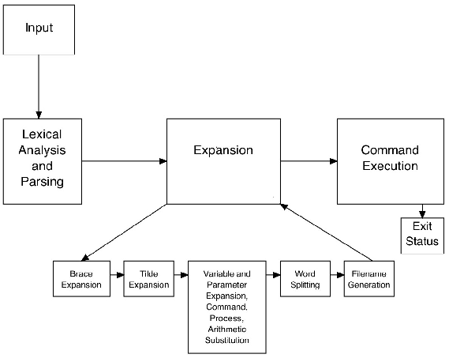

# ft_sh

  

Image source: [The Bourne-Again Shell](https://www.aosabook.org/en/bash.html)

## TODO

LEXER-PARSER-AST

Le plus gros du travail

- Lexer : découpe la commande en tokens et checke les erreurs de syntaxe + procédure debug qui affiche les tokens
- Le parser : checke les erreurs de grammaire et construit l'AST + procédure debug pour avoir l'arbre en .dot
- Les fonctions nécessaires à l'AST

--------

EXECUTION

- Récupérer le code du rush pipex

--------

CI

- Automatiser tests

