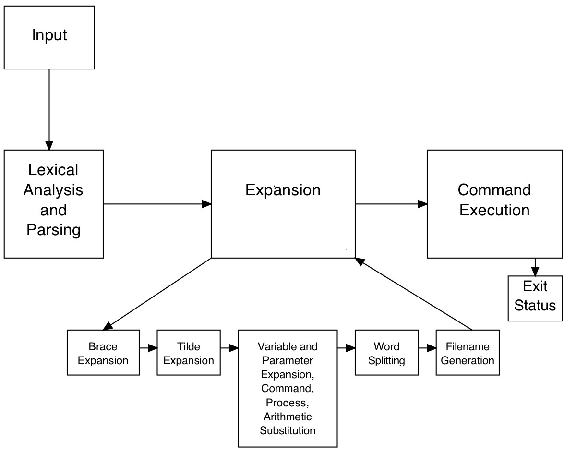

# Process

# Table of Contents
1. [Architecture](#architecture)
2. [Steps](#steps)
    1. [Environment](#environment)
    2. [Input processing](#input-processing)
    3. [Signal handling](#signal-handling)
    4. [Parsing](#parsing)
    5. [Build command table](#build-command-table)
    6. [Command Search](#command-search)
    7. [Execution](#execution)
    8. [Process Completion Status](#process-completion-status)
    9. [Builtin commands](#builtin-commands)

# Architecture

<p align="center">
  
</p>

Image source: [The Bourne-Again Shell](https://www.aosabook.org/en/bash.html)

Subdirectories are organized following more or less this architecture:

1. **Input Processing**

- Read the command line

2. **Parsing**

- Parses the command line and stores it in an Abstract Syntax Tree (AST).
- Is composed of:
  - A lexer (Lexical Analyzer​): splits the command into tokens.
  - A parser: processes the tokens according to a grammar and builds the AST.
  - An AST: stores the data.

3. **Expansion**

- Word expansions, substitutions, aliases.

4. **Subsystems**

- Environment Variables: set, expand and print environment variables.
- Utils for expansion.
- Wildcards (bonus).
- Subshells.
- Also added signal handling functions.

5. **Execution**

- Traverse the AST and execute commands.
- Create pipes to communicate the output of one process to the input of the next one.
- Handle redirections.

6. **Recoded builtin functions** required by the school project.

7. **Utils** (functions to display error messages and so forth).

# Steps

1. Read the command line
2. Interpret the command
3. Execute the command
4. Collects the command return status

## Environment

### Get the environment

```c
int main (int argc, char **argv, char **envp)
```

> The `envp` argument gives the program’s environment; it is the same as the value of environ.

[GNu.org: Program Arguments](https://www.gnu.org/software/libc/manual/html_node/Program-Arguments.html)

### Functions to handle the environment

An array of strings to represent the environment.

> The environment is represented as an array of strings. Each string is of the format ‘name=value’. The order in which strings appear in the environment is not significant, but the same name must not appear more than once. The last element of the array is a null pointer.  [(Source)](https://www.gnu.org/software/libc/manual/html_node/Environment-Access.html)

Functions to:

- Add a variable: `setenv` and `putenv`
- Delete a variable: `unsetenv`
- Find a variable: `find_env`
- Init the env by getting all the pairs: `init_env`
- Clear the env by deleting all the pairs: `clearenv`
- Get the value of a variable: `getenv`
- Print the env: `printenv`

[Gnu.org: Environment Access](https://www.gnu.org/software/libc/manual/html_node/Environment-Access.html)

## Input processing

Run an infinite loop that displays a prompt and wait for the user's input.

[Guide to Unix/Explanations/Shell Prompt](https://en.wikibooks.org/wiki/Guide_to_Unix/Explanations/Shell_Prompt)

Implement a `ft_readline()` function.

> Bash expands and displays PS1 before reading the first line of a command, and expands and displays PS2 before reading the second and subsequent lines of a multi-line command. Bash expands and displays PS0 after it reads a command but before executing it. See Controlling the Prompt, for a complete list of prompt string escape sequences.  [(Source)](https://www.gnu.org/software/bash/manual/html_node/Bash-Variables.html#Bash-Variables)

## Signal handling

> When Bash is interactive, in the absence of any traps, it ignores SIGTERM (so that ‘kill 0’ does not kill an interactive shell), and SIGINT is caught and handled (so that the wait builtin is interruptible). When Bash receives a SIGINT, it breaks out of any executing loops. In all cases, Bash ignores SIGQUIT. If job control is in effect (see Job Control), Bash ignores SIGTTIN, SIGTTOU, and SIGTSTP. [(Source)](https://www.gnu.org/software/bash/manual/html_node/Signals.html)

Resource: [Why does Ctrl-D (EOF) exit the shell?](https://unix.stackexchange.com/questions/110240/why-does-ctrl-d-eof-exit-the-shell)

> Control-C is fatal error signal 2, (130 = 128 + 2)

Resource: [Appendix E. Exit Codes With Special Meanings](https://tldp.org/LDP/abs/html/exitcodes.html)

> The exit status of an executed command is the value returned by the waitpid system call or equivalent function. Exit statuses fall between 0 and 255, though, as explained below, the shell may use values above 125 specially. Exit statuses from shell builtins and compound commands are also limited to this range. Under certain circumstances, the shell will use special values to indicate specific failure modes.  For the shell’s purposes, a command which exits with a zero exit status has succeeded. A non-zero exit status indicates failure. This seemingly counter-intuitive scheme is used so there is one well-defined way to indicate success and a variety of ways to indicate various failure modes. When a command terminates on a fatal signal whose number is N, Bash uses the value 128+N as the exit status. 

[3.7.5 Exit Status](https://www.gnu.org/software/bash/manual/html_node/Exit-Status.html)

> In all cases, Bash ignores `SIGQUIT`.  [(Source)](https://www.gnu.org/software/bash/manual/html_node/Signals.html)

* `SIG_IGN`: Ignores the signal. Usage: `signal(SIGINT, SIG_IGN)`.
* `SIG_DFL`: Sets the default behaviour for the signal. This is useful when you want to reset the behaviour for a signal after having made some modifications. Usage: `signal(SIGINT, SIG_DFL)`.

Notes: To complete the mandatory part without the bonuses, we should be able to use `sigaction` but the latter is not an authorized function. Some cases can't be handled in a clean way.

## Parsing

Steps:

- The command string is passed to the lexer
- The string is split into tokens
- The parser transforms the tokens into and abstract syntaxt tree
- Traverse the abstract syntax tree to execute the commands

### Lexer

- Pass the command line to the lexer
- Tokenize the input
  - Process input char by char
- Pass the tokens to the parser

See 2.3 Token Recognition: [Shell Command Language (POSIX)](https://pubs.opengroup.org/onlinepubs/9699919799.2018edition/utilities/V3_chap02.html)

Will require improvments: states, backtracking, ...

#### Quoting/escaping meta-characters

> First thing you have to understand is that certain characters, called meta-characters, have special meanings. The actual meaning depends on the program that sees this meta-character. Some characters are special to the Unix shell, and some are special to a utility like sed or grep.  
Before you study regular expressions, it is important that you understand how to use the shell to send regular expressions to a program. Or to put it another way, you want to say "Hey Shell. Ignore these meta-characters. I want the utility to treat them special, not you!" The mechanism to do this is called quoting. In other works, you put quotes around the meta-characters to inticate to the shell that they are not special - as far as the shell is concerned. When you quote a character, you ask the shell to leave it alone - and pass it on unchanged to the utility.  [(Source)](https://www.grymoire.com/Unix/Quote.html)

| Symbol   | Use                    |
| -------- | ---------------------- |
| `\`      | Single Character Quote |
| `"`      | Weak Quotes            |
| `'`      | Strong Quotes          |

See 2.2 Quoting: [Shell Command Language (POSIX)](https://pubs.opengroup.org/onlinepubs/9699919799.2018edition/utilities/V3_chap02.html)

> The backslash retains its special meaning only when followed by one of the following characters: ‘$’, ‘`’, ‘"’, ‘\’, or newline. Within double quotes, backslashes that are followed by one of these characters are removed. Backslashes preceding characters without a special meaning are left unmodified. A double quote may be quoted within double quotes by preceding it with a backslash.  [(Source)](https://www.gnu.org/software/bash/manual/bash.html#Double-Quotes)

### Parser

- Check for grammar errors
- Process the tokens into an Abstract Syntax Tree (AST)
- Visitor to navigate the AST

#### Debug mode

Save the AST to [.dot](https://en.wikipedia.org/wiki/DOT_(graph_description_language)) and then to .svg.

```
digraph graphname {
    a -> b -> c;
    b -> d;
}
```

## Build command table

Pre-order (NLR) seems the most appropriate search but I didn't apply it.

Go down one level to the recursive argument N. If N exists (is non-empty) execute the following three operations in this order:

- (N)	Process the current node N itself.
- (L)	Recursively traverse N's left subtree.
- (R)	Recursively traverse N's right subtree.

Source: [Wiki: Tree Traversal](https://en.wikipedia.org/wiki/Tree_traversal)

For the minishell version of ft_sh, only the `command` and `pipe_sequence` nodes
are traversed.

## Command Search

> If the command name found by the shell at the beginning of the command line contains any slashes, the shell does not use PATH to find the executable file. If there are slashes, the shell executes that file pathname directly as a program and does not need to search for it:

```console
$ /bin/foo # executes the file /bin/foo; does not search PATH
$ bar/foo  # executes the file foo in the sub-directory bar; does not search PATH
$ ./foo    # executes the foo in the current directory; does not search PATH
$ ../foo   # executes the foo in the parent directory; does not search PATH
```

Source: [Shell search PATH – finding and running commands](http://teaching.idallen.com/cst8207/12f/notes/400_search_path.html)

## Execution

- If node is a command
  - Malloc command table
- While node is a pipe sequence
  - Add simple command to command table
  - If right node is NULL
    - Execute command table, free it and return
  - Else
    - node = node->right

> When a simple command other than a builtin or shell function is to be executed, it is invoked in a separate execution environment

- [Gnu.org: Command Execution Environment](https://www.gnu.org/software/bash/manual/html_node/Command-Execution-Environment.html)

### Word Expansions

> The reason that using a variable is called substitution is that the shell literally replaces each reference to any variable with its value. This is done while evaluating the command-line, which means that the variable substitution is made before the command is actually executed.  [(Source)](https://en.wikibooks.org/wiki/Bourne_Shell_Scripting/Variable_Expansion)

> As you can see, reference the value of a variable by preceding it with a $ sign. The shell takes this to mean that it should substitute the value of the variable when it comes across this.  [(Source)](https://www.digitalocean.com/community/tutorials/how-to-read-and-set-environmental-and-shell-variables-on-linux)

> `$?` holds the return value set by the previously executed command.  [(Source)](https://bash.cyberciti.biz/guide/Parameters_Set_by_the_Shell)

### Pipes

> The output of each command in the pipeline is connected via a pipe to the input of the next command. That is, each command reads the previous command’s output. This connection is performed before any redirections specified by the command.  [(Source)](https://www.gnu.org/software/bash/manual/html_node/Pipelines.html#Pipelines)

> If the parent wants to receive data from the child, it should close fd[1], and the child should close fd[0]. If the parent wants to send data to the child, it should close fd[0], and the child should close fd[1]. Since descriptors are shared between the parent and child, we should always be sure to close the end of pipe we aren't concerned with. On a technical note, the EOF will never be returned if the unnecessary ends of the pipe are not explicitly closed. [(Source)](https://tldp.org/LDP/lpg/node11.html)

- [Pipe | Redirection < > Precedence](https://stackoverflow.com/questions/12942042/pipe-redirection-precedence
)

### Redirections

Keep the last `io_file`.

For example, "test" is written to `file2`.

```console
echo "test" > file1 > file2
echo "test" >> file1 >> file2
```

And the following prints `file2`.

```console
cat < file1 < file2
```

> When you use `>`, the file is opened in truncation mode so its contents are removed before the command attempts to read it.  
When you use `>>`, the file is opened in append mode so the existing data is preserved.  [(Source)](https://superuser.com/questions/597244/why-does-redirecting-the-output-of-a-file-to-itself-produce-a-blank-file)

That's why the command below produces an empty `file1` and writes in `file2`.

```console
echo "test" > file1 > file2
```

Also, if `file1` has something written in it, and we run the following, `file1` will be empty.

```console
> file1
```

#### Redirecting Input

```
< WORD
```

O_RDONLY

#### Redirecting Output

> If the file does not exist, it shall be created; otherwise, it shall be truncated to be an empty file after being opened.  [(Source)](https://pubs.opengroup.org/onlinepubs/9699919799.2018edition/utilities/V3_chap02.html#tag_18_07_04)

```
> WORD
```

O_WRONLY | O_CREAT | O_TRUNC

#### Appending Redirected Output

> Appended output redirection shall cause the file whose name results from the expansion of word to be opened for output on the designated file descriptor. The file is opened as if the open() function as defined in the System Interfaces volume of POSIX.1-2017 was called with the O_APPEND flag. If the file does not exist, it shall be created.  [(Source)](https://pubs.opengroup.org/onlinepubs/9699919799.2018edition/utilities/V3_chap02.html#tag_18_07_04)

```
>> WORD
```

O_WRONLY | O_CREAT | O_APPEND

#### dup() /dup2()

```c
int dup(int oldfd);
```

```
oldfd ----------------+----------> resource
                      |
return_value ---------+
```

`oldfd` and the return value are both fd that point to the resource.

```c
int dup2(int oldfd, int newfd);
```

```
oldfd ---  (dup2 cuts access   )       --+------------> resource
                                         |
newfd -----------------------------------+
```

`oldfd` is closed while `newfd` is the duplicate of `oldfd`.

`dup2()` makes `newfd` be the copy of `oldfd`, closing `newfd` first if necessary, but note the following:

- If `oldfd` is not a valid file descriptor, then the call fails, and `newfd` is not closed. 
- If `oldfd` is a valid file descriptor, and `newfd` has the same value as `oldfd`, then `dup2()` does nothing, and returns`newfd`.

Source: [Programmation systeme: execve(), fork() et pipe()](https://n-pn.fr/t/2318-c--programmation-systeme-execve-fork-et-pipe)

### Character device drivers

- [ The Linux Kernel: Character device drivers](https://linux-kernel-labs.github.io/refs/heads/master/labs/device_drivers.html)

## Process Completion Status

`WIFEXITED(wstatus)` returns true if the child terminated normally, that is, by calling exit(3) or _exit(2), or by returning from main().

`WEXITSTATUS(wstatus)` returns the exit status of the child. This macro should be employed only if `WIFEXITED` returned true.

Source: [wait(2) — Linux manual page](https://man7.org/linux/man-pages/man2/wait.2.html)

## Builtin commands

From 42 subject:

It must implement the builtins like in bash:
- echo with option ’-n’
- cd with only a relative or absolute path
- pwd without any options
- export without any options
- unset without any options
- env without any options and any arguments
- exit without any options

- [Gnu.org: Bourne Shell Builtins](https://www.gnu.org/software/bash/manual/html_node/Bourne-Shell-Builtins.html)
- [Gnu.org: Bash Builtin Commands](https://www.gnu.org/software/bash/manual/html_node/Bash-Builtins.html)


### env

> If no command name is specified following the environment specifications, the resulting environment is printed. This is like specifying the printenv program.  [(Source)](https://www.gnu.org/software/coreutils/manual/html_node/env-invocation.html)

### unset

- [unset posix man page](https://www.unix.com/man-page/posix/1p/unset/)
