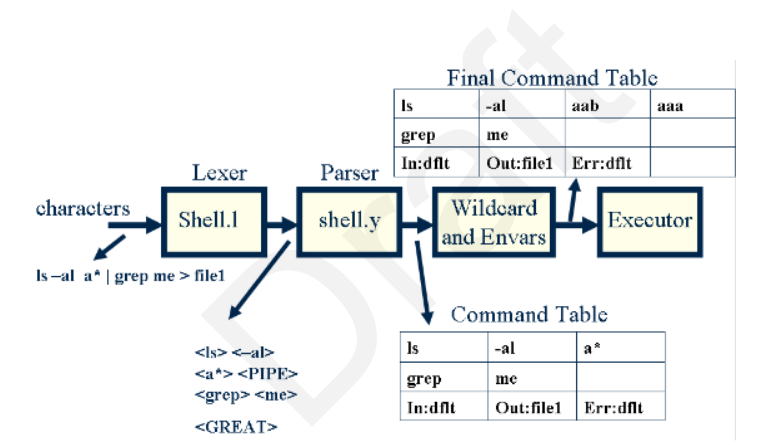

# Process

1. Read the command line
2. Interpret the command
3. Execute the command
4. Return the result
5. Collects the command return status

## Organisation

1. The Parser​

- Reads the command line and stores it in a Command Table structure.
- Is composed of:
  - A lexer (Lexical Analyzer​): splits the command into tokens.
  - A parser: processes the tokens according to a grammar and builds the Command Table.

<p align="center">
  
</p>

Images source: [Writing Your Own Shell (PDF)](https://www.cs.purdue.edu/homes/grr/SystemsProgrammingBook/Book/Chapter5-WritingYourOwnShell.pdf)

2. The Executor​

- Takes the Command Table structure and creates a process for each Simple Command.
- Create pipes to communicate the output of one process to the input of the next one.
- Redirects the standard input, standard output, and standard error in case of redirections. 

3. ​Shell Subsystems

- Environment Variables: set, expand and print environment variables.
- Wildcards (bonus)
- Subshells (check if bonus)

## Steps

### Get the environment

```c
int main (int argc, char **argv, char **envp)
```

The `envp` argument gives the program’s environment; it is the same as the value of environ.

Resource: [GNu.org: Program Arguments](https://www.gnu.org/software/libc/manual/html_node/Program-Arguments.html)

### Functions to handle the environment

An array of strings to represent the environment.

> The environment is represented as an array of strings. Each string is of the format ‘name=value’. The order in which strings appear in the environment is not significant, but the same name must not appear more than once. The last element of the array is a null pointer.  [(Source)](https://www.gnu.org/software/libc/manual/html_node/Environment-Access.html)

Functions to:

- Add a variable: `setenv` and `putenv`
- Delete a variable: `unsetenv`
- Find a variable: `find_env`
- Init the env by getting all the pairs: `init_env`
- Clear the env by deleting all the pairs: `clearenv`
- Get the value of a variable: `getenv`
- Print the env: `printenv`

Resource: [Gnu.org: Environment Access](https://www.gnu.org/software/libc/manual/html_node/Environment-Access.html)

### Shell prompt

Run an infinite loop that displays a prompt and wait for the user's input.

Resource: [Guide to Unix/Explanations/Shell Prompt](https://en.wikibooks.org/wiki/Guide_to_Unix/Explanations/Shell_Prompt)

### Register signal handling (basic way first)

> When Bash is interactive, in the absence of any traps, it ignores SIGTERM (so that ‘kill 0’ does not kill an interactive shell), and SIGINT is caught and handled (so that the wait builtin is interruptible). When Bash receives a SIGINT, it breaks out of any executing loops. In all cases, Bash ignores SIGQUIT. If job control is in effect (see Job Control), Bash ignores SIGTTIN, SIGTTOU, and SIGTSTP. [(Source)](https://www.gnu.org/software/bash/manual/html_node/Signals.html)

Resource: [Why does Ctrl-D (EOF) exit the shell?](https://unix.stackexchange.com/questions/110240/why-does-ctrl-d-eof-exit-the-shell)

> Control-C is fatal error signal 2, (130 = 128 + 2)

Resource: [Appendix E. Exit Codes With Special Meanings](https://tldp.org/LDP/abs/html/exitcodes.html)

> The exit status of an executed command is the value returned by the waitpid system call or equivalent function. Exit statuses fall between 0 and 255, though, as explained below, the shell may use values above 125 specially. Exit statuses from shell builtins and compound commands are also limited to this range. Under certain circumstances, the shell will use special values to indicate specific failure modes.  For the shell’s purposes, a command which exits with a zero exit status has succeeded. A non-zero exit status indicates failure. This seemingly counter-intuitive scheme is used so there is one well-defined way to indicate success and a variety of ways to indicate various failure modes. When a command terminates on a fatal signal whose number is N, Bash uses the value 128+N as the exit status. 

Resource: [3.7.5 Exit Status](https://www.gnu.org/software/bash/manual/html_node/Exit-Status.html)

> In all cases, Bash ignores `SIGQUIT`.  [(Source)](https://www.gnu.org/software/bash/manual/html_node/Signals.html)

### Parsing

- The command string is passed to the lexer
- The string is split into tokens
- The parser transforms the tokens into and abstract syntaxt tree
- Traverse the abstract syntax tree to execute the commands

### Lexer

- Pass the command line to the lexer
- Tokenize the input
  - Process input char by char
  - Backtracking
- Pass the tokens to the parser

See 2.3 Token Recognition: [Shell Command Language (POSIX)](https://pubs.opengroup.org/onlinepubs/9699919799.2018edition/utilities/V3_chap02.html)

#### Quoting/escaping meta-characters

> First thing you have to understand is that certain characters, called meta-characters, have special meanings. The actual meaning depends on the program that sees this meta-character. Some characters are special to the Unix shell, and some are special to a utility like sed or grep.  
Before you study regular expressions, it is important that you understand how to use the shell to send regular expressions to a program. Or to put it another way, you want to say "Hey Shell. Ignore these meta-characters. I want the utility to treat them special, not you!" The mechanism to do this is called quoting. In other works, you put quotes around the meta-characters to inticate to the shell that they are not special - as far as the shell is concerned. When you quote a character, you ask the shell to leave it alone - and pass it on unchanged to the utility.  [(Source)](https://www.grymoire.com/Unix/Quote.html)

| Symbol   | Use                    |
| -------- | ---------------------- |
| `\`      | Single Character Quote |
| `"`      | Weak Quotes            |
| `'`      | Strong Quotes          |

See 2.2 Quoting: [Shell Command Language (POSIX)](https://pubs.opengroup.org/onlinepubs/9699919799.2018edition/utilities/V3_chap02.html)

### Parsing

- The parser builds the AST.

## Built-in commands

### env

> If no command name is specified following the environment specifications, the resulting environment is printed. This is like specifying the printenv program.

- [23.2 env: Run a command in a modified environment](https://www.gnu.org/software/coreutils/manual/html_node/env-invocation.html)

### unset

[unset(1p) [posix man page]](https://www.unix.com/man-page/posix/1p/unset/)
